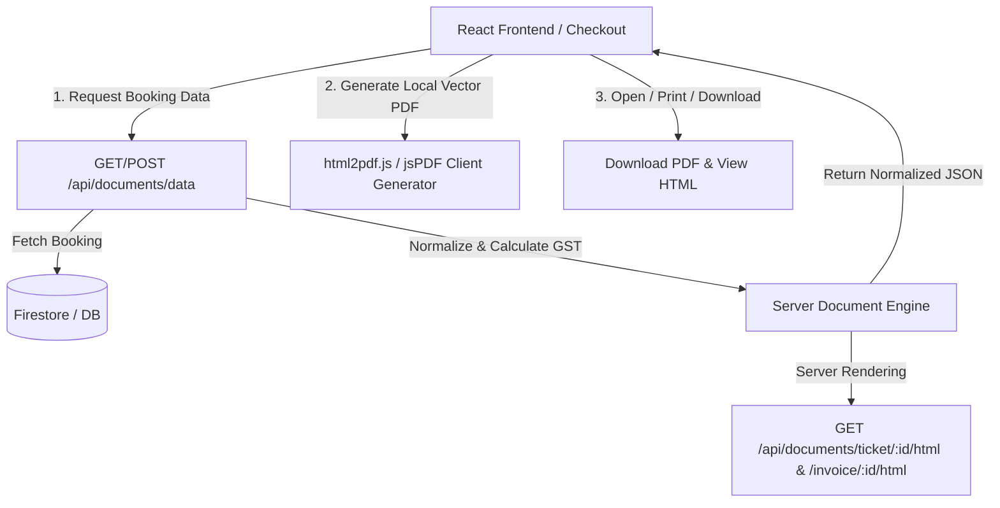

# Implementation Plan: Dynamic PDF Ticket & Tax Invoice Engine

**Feature ID**: `008-dynamic-pdf-ticket-invoice`  
**Status**: Ready for Implementation  

---

## 1. Technical Architecture

---

## 2. Core Modules to Implement

### 2.1 Backend Services
1. **`server/services/documentTemplateEngine.ts`**:
   - `buildDynamicDocumentData(bookingId, vertical, rawBooking)`: Builds 100% dynamic JSON schema matching the exact user specification.
   - `convertNumberToIndianWords(amount)`: Converts numbers to Indian currency words (`Rupees ... Only`).
   - `renderTicketHTML(data)`: Generates clean, printer-ready A4 HTML for Flight, Hotel, Bus, Car with inline SVGs.
   - `renderInvoiceHTML(data)`: Generates clean, printer-ready A4 HTML for Tax Invoice with inline SVGs, stamp, signature, and tax table.
   - `generateBarcodeSVG(code)`: Generates crisp inline SVG barcode.
   - `generateQRCodeSVG(text)`: Generates inline SVG QR code.
2. **`server/routes/documents.ts`**:
   - `POST /api/documents/data`
   - `GET /api/documents/data/:bookingId`
   - `GET /api/documents/ticket/:bookingId/html`
   - `GET /api/documents/invoice/:bookingId/html`
   - `POST /api/documents/render-html`
3. Wire route into `server.ts`.

### 2.2 Frontend Integration
1. **`src/services/DocumentService.ts`**:
   - `fetchBookingDocumentData(bookingId, vertical, rawBooking)`
   - `downloadTicketPDF(bookingData)`
   - `downloadInvoicePDF(bookingData)`
   - `openDocumentPreview(bookingData, type)`
2. **`src/components/booking/TicketSuccess.tsx`**:
   - Add dual buttons: "Download E-Ticket PDF" & "Download Tax Invoice PDF".
3. **`src/components/booking/agoda/PaymentStatusScreen.tsx`**:
   - Add "Download Voucher / Ticket PDF" & "Download Tax Invoice PDF".
4. **`src/components/booking/BookingFlowModal.tsx` & Checkout Pages**:
   - Connect universal document download handlers.

---

## 3. Verification Plan
1. Test API endpoints for all 4 verticals (`FLIGHT`, `HOTEL`, `BUS`, `CAR`):
   - Check JSON structure against user's schema.
   - Verify zero hardcoded values.
   - Verify calculations: Base + Ancillary + Net Service + CGST + SGST + IGST = Total.
   - Verify words conversion.
2. Test HTML rendering for all 4 verticals:
   - Check logo rendering, barcodes, QR codes, tables, stamp, signature.
3. Test PDF generation in browser:
   - A4 size compliance, no page overflow, crisp typography.
